# CafeRN
Simple react native app for Cafe

1) yarn install
2) yarn start

Also you need to install json-server:
1) https://github.com/TarasevichDarya/json-server
2) yarn install
3) json-server --watch db.json -p 3001 -d 2000

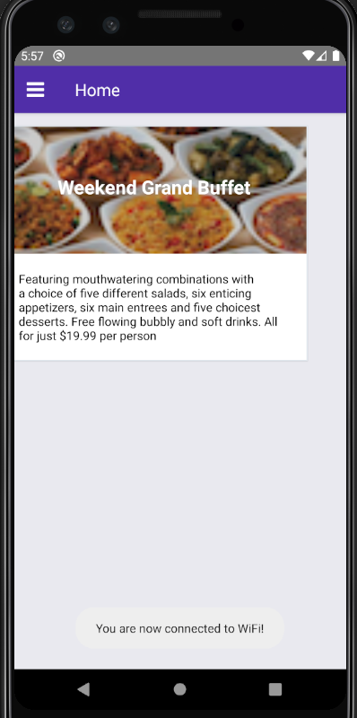

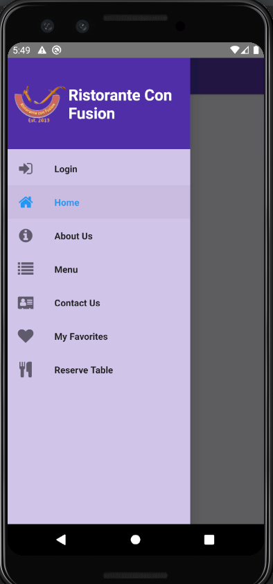
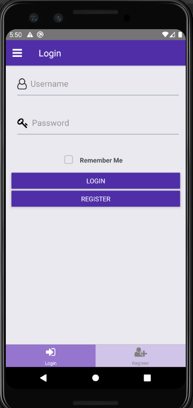
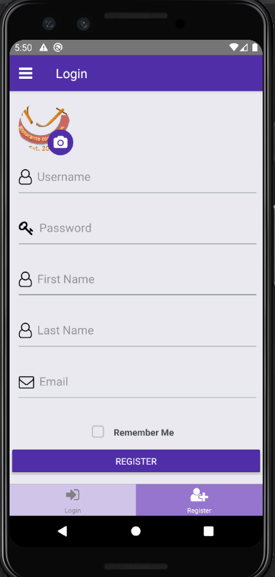
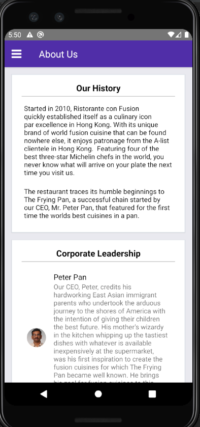
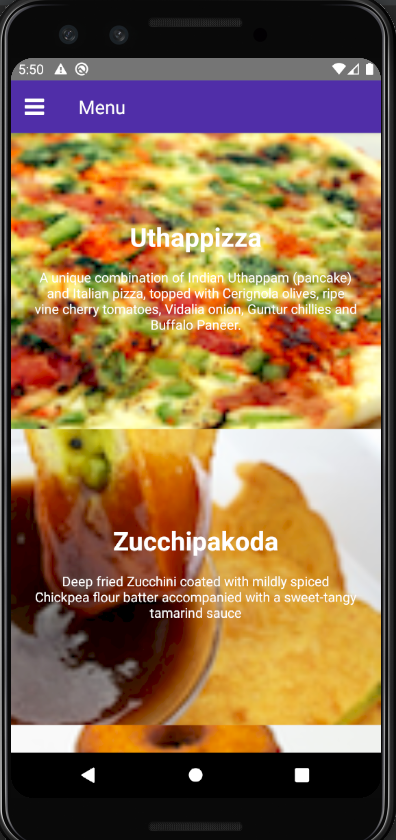
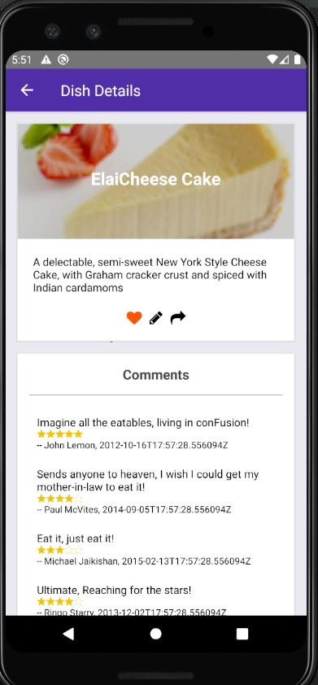
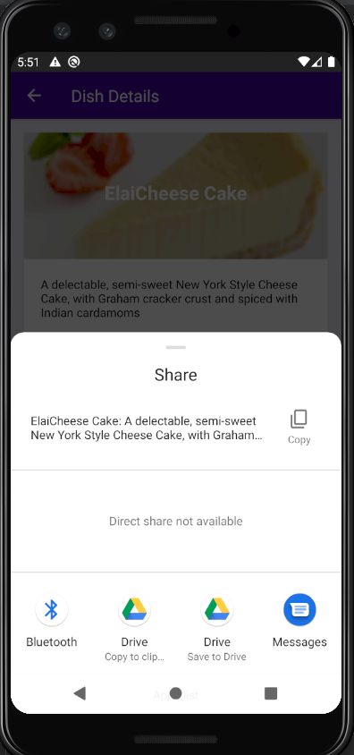
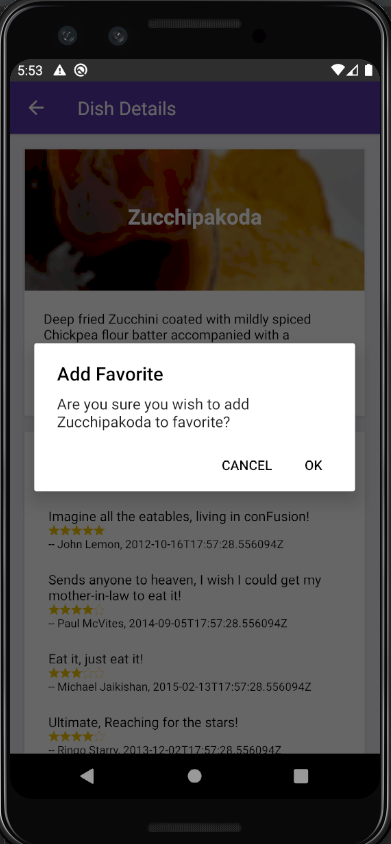
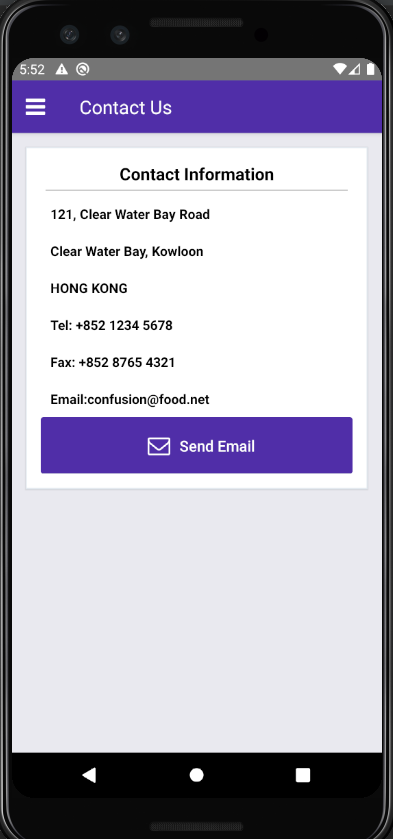
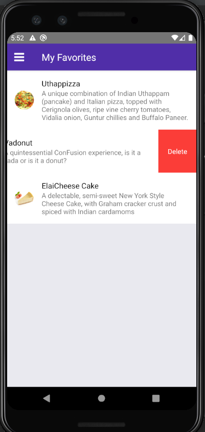
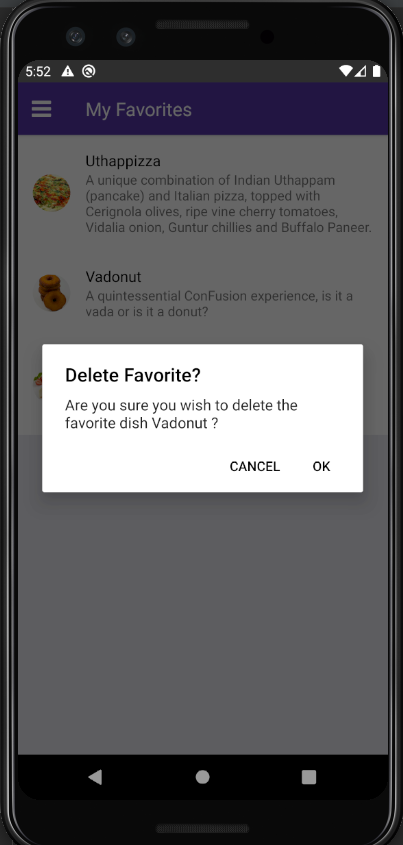
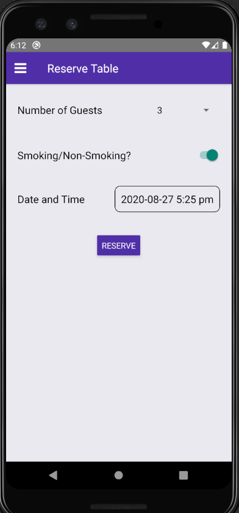
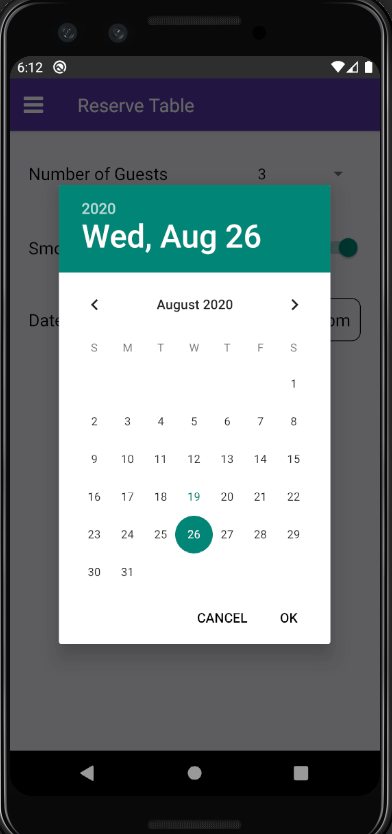
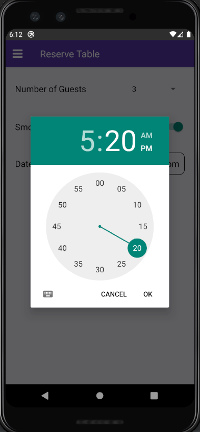
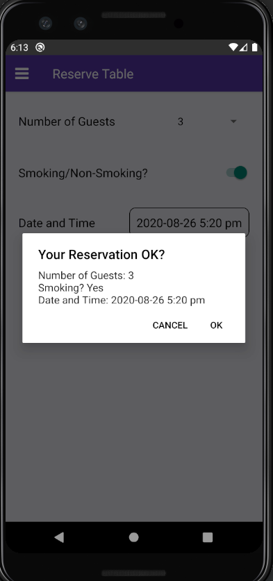
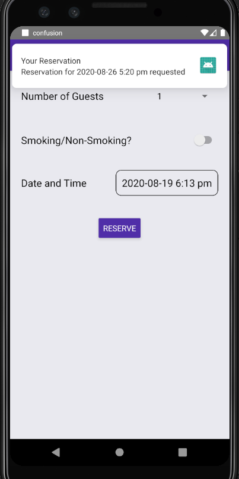
