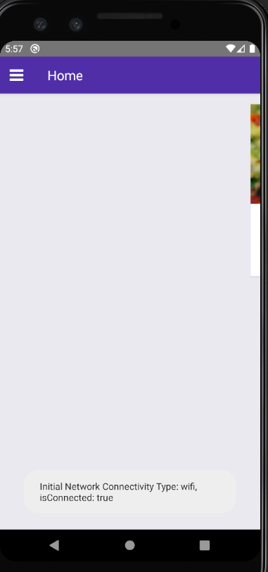

# CafeRN
Simple react native app

1) yarn install
2) node_modules/react-native-safe-area-view => index.js, 152 => getNode() instead of _component (because of lib version)
3) yarn start

Also you need to install json-server:
1) https://github.com/TarasevichDarya/json-server
2) yarn install
3) json-server --watch db.json -p 3001 -d 2000

